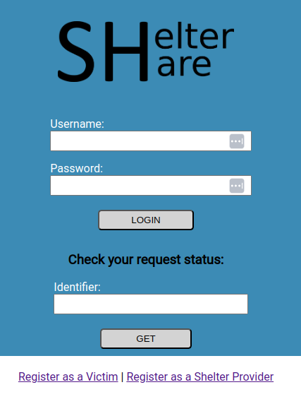
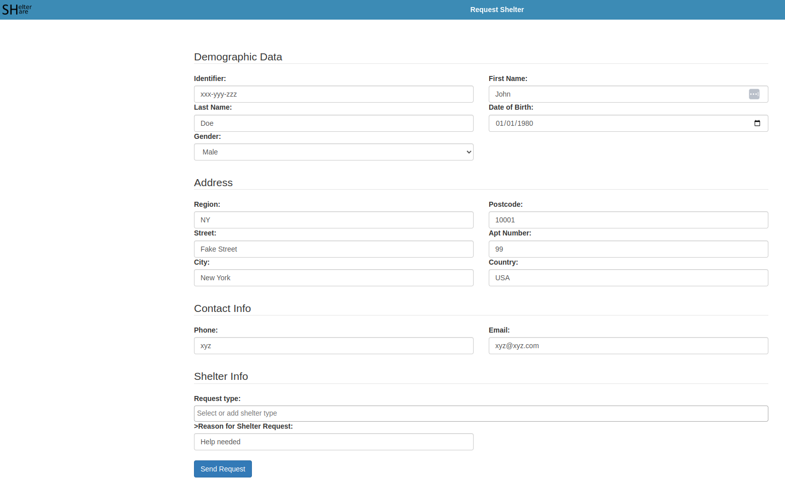
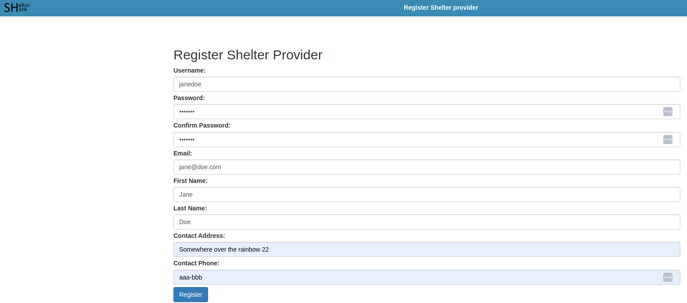
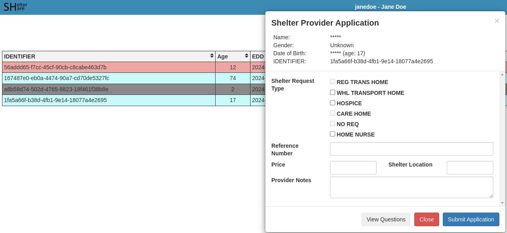
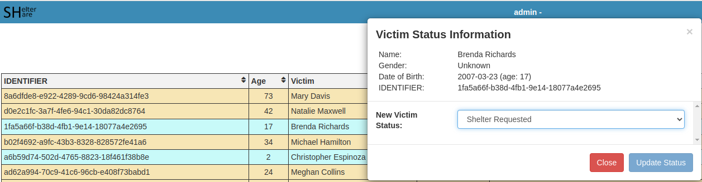
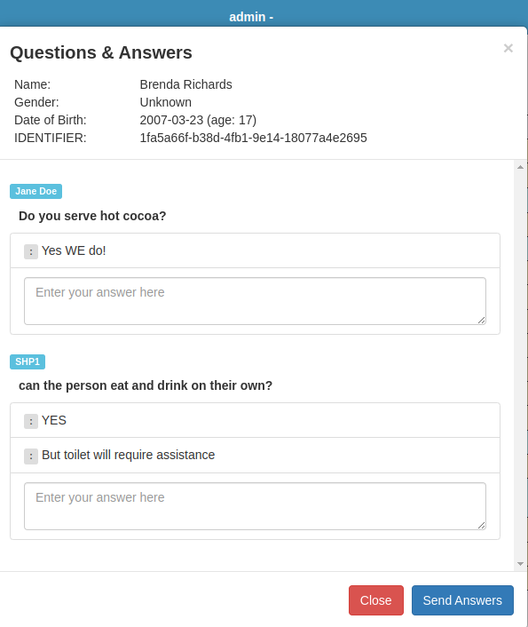
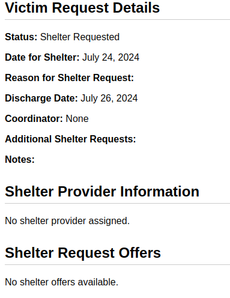
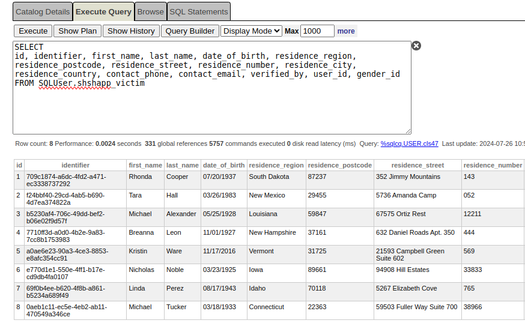

# Project Title
 ShelterShare

## Description
ShelterShare is a Django application designed to connect disaster victims with shelter providers.

The application aims to streamline the process of finding and offering shelter during times of disaster, ensuring that victims can quickly and easily access safe places to stay.

## Features

- **User Authentication:** Secure login and logout functionality for users, including shelter providers and victims.

- **Shelter Requests:** Register new shelter requests and check status of requests.

- **Shelter Provider Management:** Register and update shelter provider information.

- **Request Management:** Submit and track shelter requests from victims, including managing and updating request details.

- **Questions and Answers:** Handle questions and answers related to victim requests, allowing for better communication and clarity.

- **Request Status:** Update and view the status of requests and offers.

**Database Integration:** ShelterShare uses ***InterSystems IRIS*** as its database system.

These features are designed to ensure an efficient and effective connection between disaster victims and shelter providers.

## Try Online Demo

https://sheltershare.zsucic.com/

### Testing Accounts

**Provided logins:**

**Coordinator account 1:**
***Username:*** coordinator_01
***Password:*** coordpass

**Coordinator account 2:**
***Username:*** coordinator_02
***Password:*** coordpass

**Shelter Provider account 1:**
***Username:*** shelterprovider_01
***Password:*** shelterpass

**Shelter Provider account 2:**
***Username:*** shelterprovider_02
***Password:*** shelterpass

## Installation and Setup

Follow these steps to set up ShelterShare locally.

### Prerequisites
## For running in a Docker Container
- Docker
- Docker Compose

## For running as a standalone app
- **Python 3.x**
- **Django 5.0.7**
- **gunicorn**
- **uvicorn[standard]**
- **channels**
- **Faker**
- **django-iris**
- **InterSystems IRIS**

### Clone the Repository

Clone the ShelterShare repository:
https://github.com/zsucic/sheltershare.git

Navigate to sheltershare folder:
`cd sheltershare`

Build and start the Docker containers:
`docker-compose up --build -d`

Web Interface: http://localhost:8000

Django Admin Interface: http://localhost:8000/admin/

## Login

**Logins provided for testing purposes:**

- **Coordinator account 1:**

    ***Username:*** coordinator_01
    ***Password:*** coordpass

- **Coordinator account 2:**

    ***Username:*** coordinator_02
    ***Password:*** coordpass

- **Shelter Provider account 1:**

    ***Username:*** shelterprovider_01
    ***Password:*** shelterpass

- **Shelter Provider account 2:**

    ***Username:*** shelterprovider_02
    ***Password:*** shelterpass

## URL Patterns and Views

ShelterShare includes various endpoints to manage users, victims, requests, offers, and communications. Below is a summary of the key URL patterns and their corresponding views:

### Authentication
- **Login:** `/login/` - User login view.
- **Logout:** `/logout/` - User logout view.

### User and Victim Management
- **Update User Info:** `/update_user_info/` - Update user information.
- **Update Victim Info:** `/update_victim/` - Update victim information.
- **Register Victim:** `/register_victim/` - Register a new victim.
- **Register Shelter Provider:** `/register_shelter_provider/` - Register a new shelter provider.

### Victim Requests
- **View Victim Request:** `/victim_request/<int:pk>/` - View details of a specific victim request.

### Miscellaneous
- **Generate Data:** `/generate/` - Generate random victim data (for testing purpose).
- **Home Page:** `/` - Home page.

## Contact
For further questions, support, or inquiries regarding ShelterShare, please contact HealthInnova team:

- **Željko Sučić:** [zeljko@healthinnova.com](mailto:zeljko@healthinnova.com)
- **Damir Mikloš:** [damir@healthinnova.com](mailto:damir@healthinnova.com)

